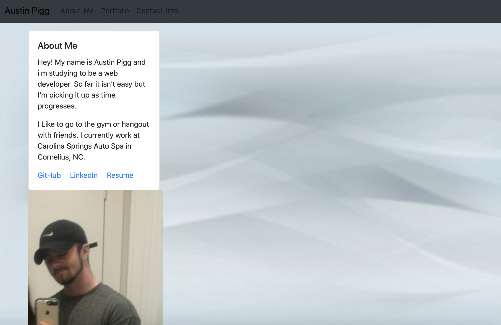
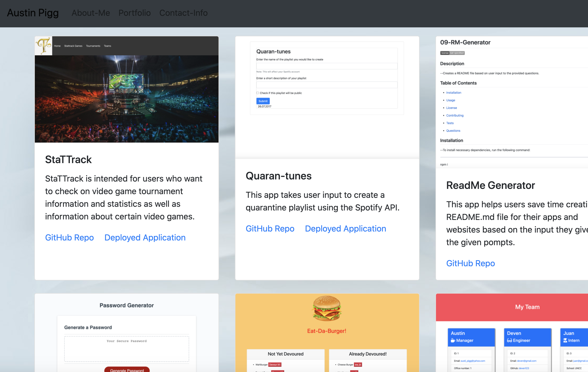
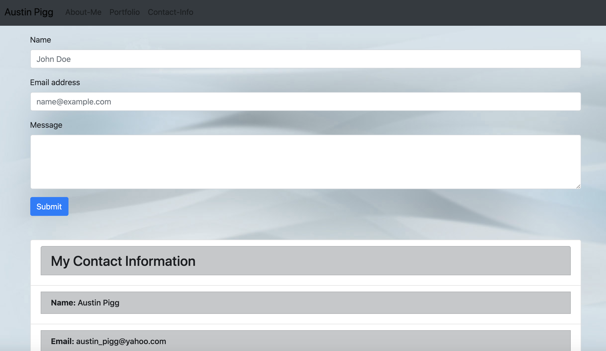

# 20-react-portfolio

## Description

* The point of this project was to re create our portfolios using react.

* It took me a while to figure out how to get the images to display.

## Dependencies used:

* bootstrap
* path
* react
* react-bootstrap
* react-dom
* react-router-dom
* react-scripts
* react-table
* reactstrap
* to-case

## Link to Repository

* https://github.com/alp13097/20-react-portfolio

## Link to Deployed Application

* https://reactportfolio19.herokuapp.com/

## Screenshots

